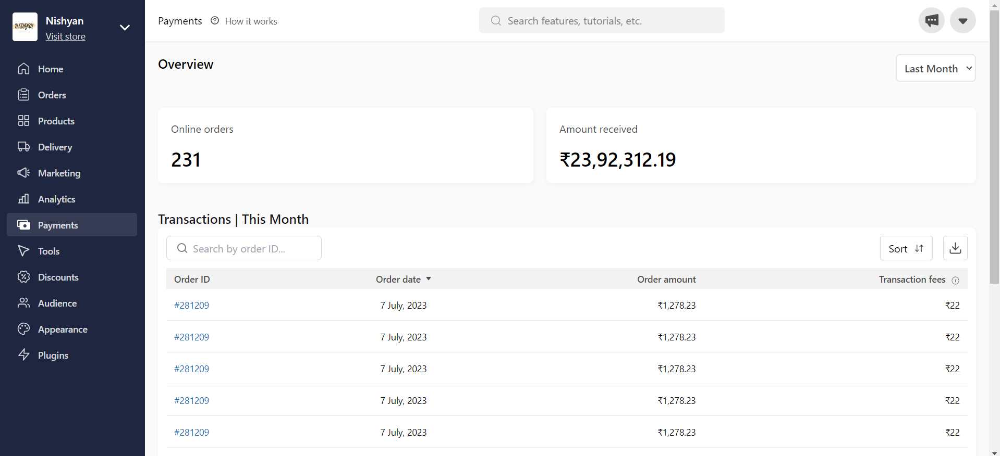

# Online Teaching Platform

It is a payment dashboard developed using ReactJS and Tailwind CSS for Dukaan assignment for Frontend Developer role
## Live
<a href="https://dukaanassignmentdibyendu.vercel.app">Live Link</a>



## Technologies Used

- ReactJS
- Tailwind CSS
- JavaScript

## Getting Started

To run the CoRider Chats application locally, follow these steps:

1. Clone this repository:

```bash
git clone https://github.com/your-username/dukaan-assignment.git

cd dukaan-assignment
```

2. Install dependencies:

```bash
npm install
```

3. Start the development server:

```bash
npm start
```

The application will be accessible at `http://localhost:3000` by default.

## Deployment

You can deploy this application on platforms like Netlify, Vercel, or any other of your choice.


## Contributing

Contributions are welcome! Feel free to open issues and pull requests.

---

**Happy Coding!**